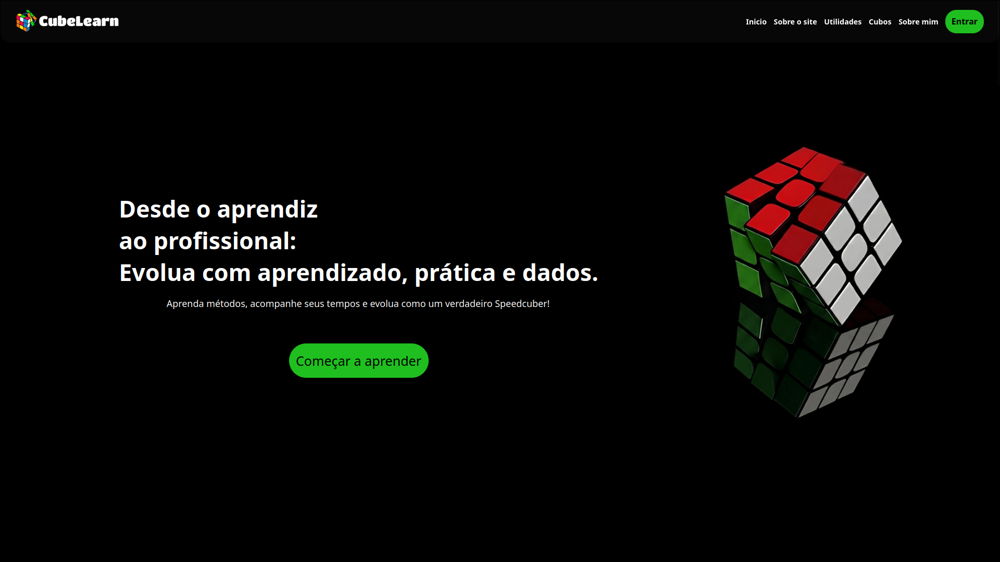
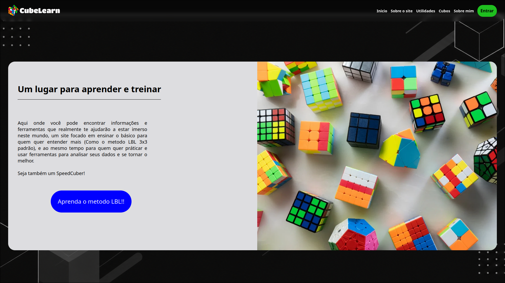
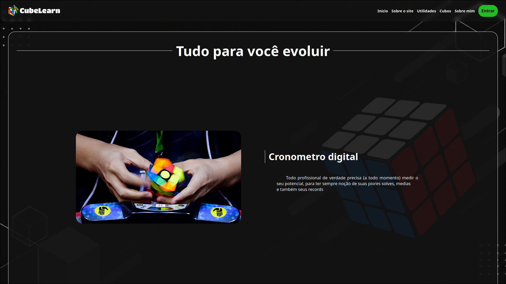
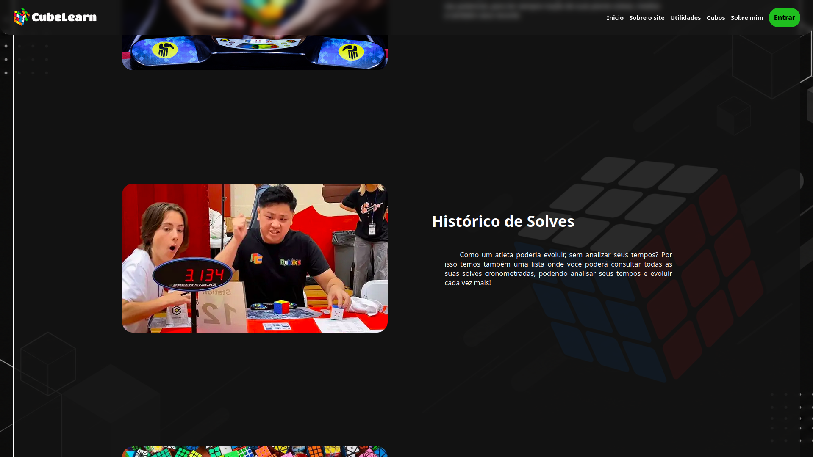
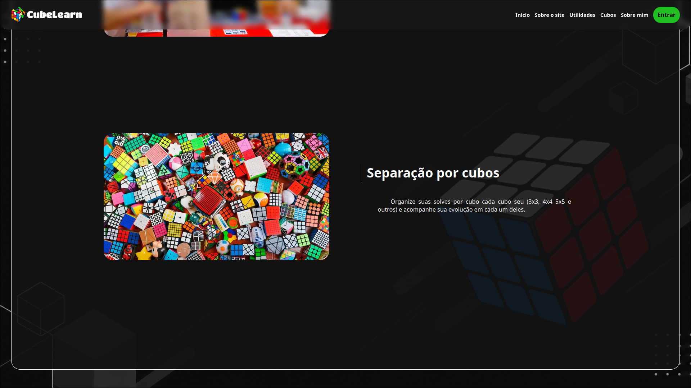
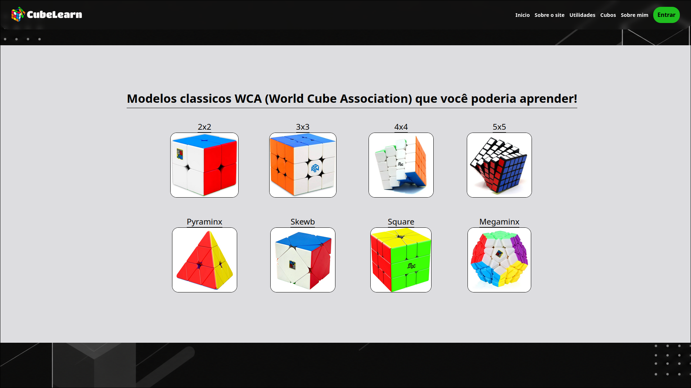
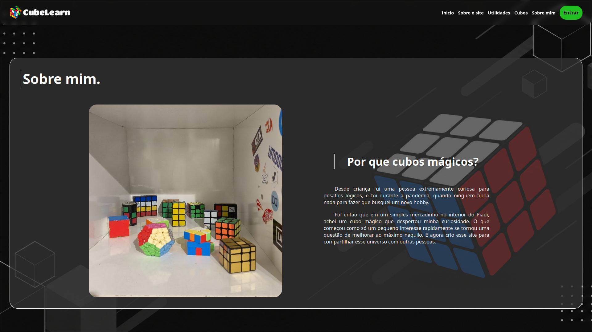

#  CubeLearn - Plataforma para SpeedCubers


##  Sobre o Projeto

O **CubeLearn** é um projeto individual desenvolvido para a **SPTech School**, com o objetivo de unir tecnologia e a comunidade de **SpeedCubing** em uma única plataforma.

O sistema foi criado para auxiliar cubistas em sua evolução, permitindo registrar tempos, acompanhar estatísticas, gerenciar diferentes cubos e visualizar seu desempenho através de dashboards interativas.

Além de oferecer ferramentas para treino e análise, o projeto também possui uma área de aprendizado voltada para iniciantes, ensinando o método **LBL (Layer By Layer)**.

---

##  Ferramentas Disponíveis

- ✅ Cronômetro para SpeedCubing
- ✅ Histórico automático de solves
- ✅ Cálculo de AVG5
- ✅ Cálculo de AVG12
- ✅ Separação de tempos por cubo
- ✅ Cadastro de múltiplos cubos
- ✅ Dashboard individual para cada cubo
- ✅ Sistema de Login e Cadastro
- ✅ Aprendizado do Método LBL

---

## 🛠️ Tecnologias Utilizadas

<div align="center">


</div>

### Tecnologias

- HTML5
- CSS3
- JavaScript
- Node.js
- SQL
- API Data-Wiz

### API Utilizada

O projeto utiliza a API Data-Wiz disponibilizada pela SPTech para integração entre o sistema e o banco de dados.

🔗 GitHub da API:

https://github.com/BandTec/web-data-viz

---

#  Páginas do Sistema

##  Home

A página inicial apresenta a proposta do projeto através de quatro seções principais.

### Seção 1 - Apresentação

Breve introdução ao universo do SpeedCubing e aos objetivos da plataforma.



---

### Seção 2 - Ferramentas

Apresentação dos principais recursos disponíveis para os usuários.



---

### Seção 3 - Método LBL

Explicação sobre o método Layer By Layer e incentivo para novos cubistas aprenderem a resolver o cubo mágico.





---

### Seção 4 - Dashboard

Prévia das análises e estatísticas disponíveis na plataforma.



---

##  Página de Aprendizado - Método LBL

Área dedicada ao ensino do método Layer By Layer (LBL), um dos métodos mais populares para iniciantes.

O usuário encontra explicações organizadas, sobre os movimentos basicos do 3x3 e também, um simples tutorial por etapas para aprender a resolver o cubo mágico pelo metodo LBL.



---

##  Página de Cadastro e Login

Responsável pela autenticação dos usuários, logo na home, voce oncontra 2 botões, "Começar a aprender" e "entrar", em qualquer um dos 2 você consegue fazer o login com authenticação no banco de dados e cadastro com verificação de força de senha, igualdade dos campos "confirmar senha" e "senha" e preenchimento de todos os campos.

### Funcionalidades

- Cadastro de usuários
- Login
- Validação de dados
- Integração com banco de dados
- Validação de força de senha

---

##  Página de Cronômetro

A principal funcionalidade do sistema.

O cronômetro permite registrar solves em tempo real e armazenar automaticamente os resultados no banco de dados, exibindo-as em um menu lateral com histórico, e indicadores de maior tempo, menor tempo, AVG5 e AVG12.

### Funcionalidades

- Cronômetro em tempo real
- Histórico automático
- Atualização dinâmica
- Salvamento no banco de dados
- AVG5
- AVG12
- Bloqueio para quem não tem Cubos mágicos cadastrados é redirecionado automaticamente para a pagina de Cadastro de Cubos

### Seleção de Cubo

Antes de iniciar uma solve, o usuário consegue selecionar qual cubo está utilizando no momento.
Dessa forma, todos os tempos registrados ficam vinculados diretamente ao cubo correspondente no banco de dados.

Isso possibilita análises individuais e comparações futuras entre diferentes cubos. Aliás, há também uma verificação, se caso o usuario não tenha nenhum cubo cadastrado, ele não consegue ir para a página de cronometro, e é automaticamente redirecionado para a página de "Cadastro de Cubos".


---


##  Página de Cadastro de Cubos

Permite que o usuário registre os cubos que possui.

Cada cubo cadastrado poderá possuir seu próprio histórico de solves e estatísticas.

### Funcionalidades

- Cadastro de cubos
- Organização por modelo
- Associação com o usuário


---

##  Dashboard

A dashboard é responsável por transformar os dados registrados em informações úteis para análise de desempenho.

Cada cubo possui sua própria visualização de métricas e estatísticas.

### Informações Disponíveis

- Melhor tempo
- Média geral
- AVG5
- AVG12
- Quantidade de solves
- Evolução de desempenho
- Comparação entre cubos
- Estatísticas individuais


---

#  Estrutura do Banco de Dados

O sistema foi desenvolvido utilizando integração entre Front-End e Banco de Dados através da API Data-Wiz.

### Relacionamentos

- Usuário → 1:N→ Cubos
- Cubo → 1:N → Solves

Essa estrutura permite que cada usuário possua diversos cubos e que cada cubo mantenha seu próprio histórico de desempenho.

---

#  Como Executar o Projeto

```bash
git clone https://github.com/seu-usuario/seu-repositorio.git

cd seu-repositorio

npm install

npm start
```

---

# Por quem e porque?

Projeto Individual desenvolvido para a disciplina de Pesquisa e Inovação da **SPTech School**.

Desenvolvido por **Iago da Silva Soares**.

---
